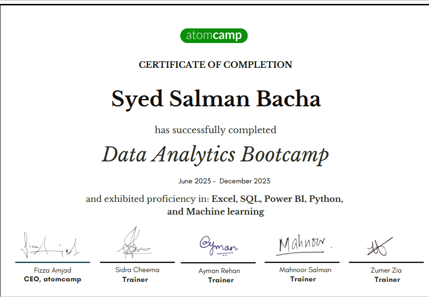

# Data Analyst 

#### Technical Skills: Python, SQL, Power BI, Tableau 

## Education
- National University of Modern Languages Islamabad Islamabad, Pakistan | BS English Literature and Linguistics 
 
- Comenius University Bratislava (Exchange Student) Bratislava, Slovakia | British and American Studies 

## Work
**Data Science Bootcamp May 2023 – Dec 2023**

- I recently completed atomcamp’s six-month data science bootcamp. I was honored to be given a 
fully funded scholarship. In the past six months, I learned a lot regarding data analysis using Excel, 
SQL, python and enhanced my analytical capabilities and communication skills. The following I 
learned during the BootCamp:

## Projects 
 **1) Beyond Numbers: A swift EDA of Saudi Arabia's Population dataset**

- Performed thorough exploratory data analysis (EDA) on Saudi population trends, unveiling nuanced 
distributions and impacts of variables like year, region, nationality, and population.
- Employing bivariate methods and visualizations with Matplotlib, Seaborn, and Plotly, revealed historical 
trends and future insights for policymakers and researchers.

⎯ [GitHub repository link:](https://github.com/Salman072-github/Saudi-Arabi-Population-Data-Swift-EDA.git)

 **2) Power Bi Project:**
 
- Completed a Power BI project analyzing survey data from data science professionals.
- Conducted data pre-processing and transformation, creating insightful visualizations and a 
comprehensive dashboard to reveal crucial trends.
- Leveraged Power BI functionalities to provide actionable insights, meeting project objectives effectively.
 
- [GitHub repository link:](https://github.com/Salman072-github/Power-BI.git)

## Certification
**ONLINE COURSES**

 - Research in Cognitive Studies and Brain Seminar | NUML 
- Power BI Workshop                                | atomcamp 
- Data Visualization with python                   | IBM 
- Programming for Everybody                        | Coursera 
- Introduction to Data Science in Python           | datacamp 
- Intermediate Python                              | datacamp 
- Python Data Structures                           | Coursera 
- R Programming                                    | alnafi 

## Services offered:

- Data preprocessing: Streamline your data for optimal analysis.
- Data cleaning: Scrub away inconsistencies and inaccuracies for reliable results.
- Exploratory data analysis: Dive deep into your data to uncover patterns and trends.
- Data visualization: Transform complex data into clear, insightful visuals for easy understanding.

## Tools of the trade:

- Excel
- Python 
- SQL
- Microsoft PowerBI
- Tableau
